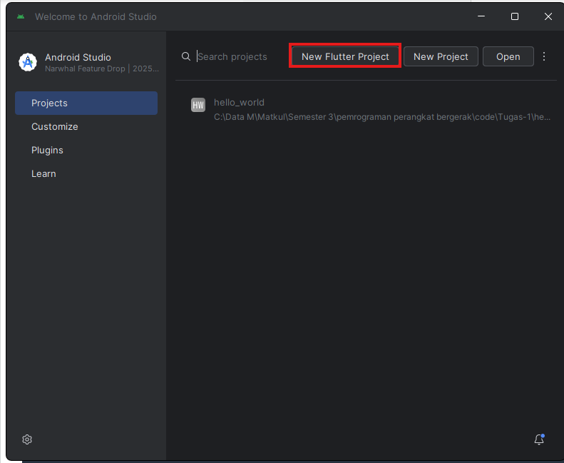
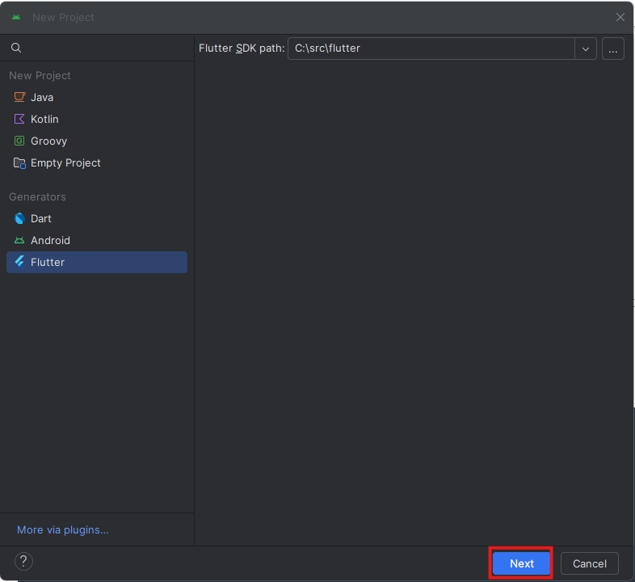
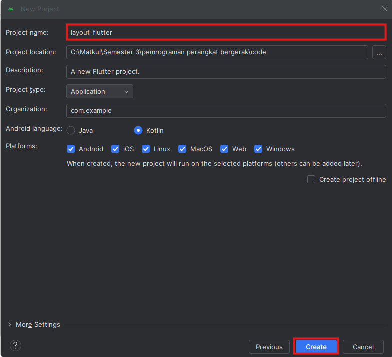
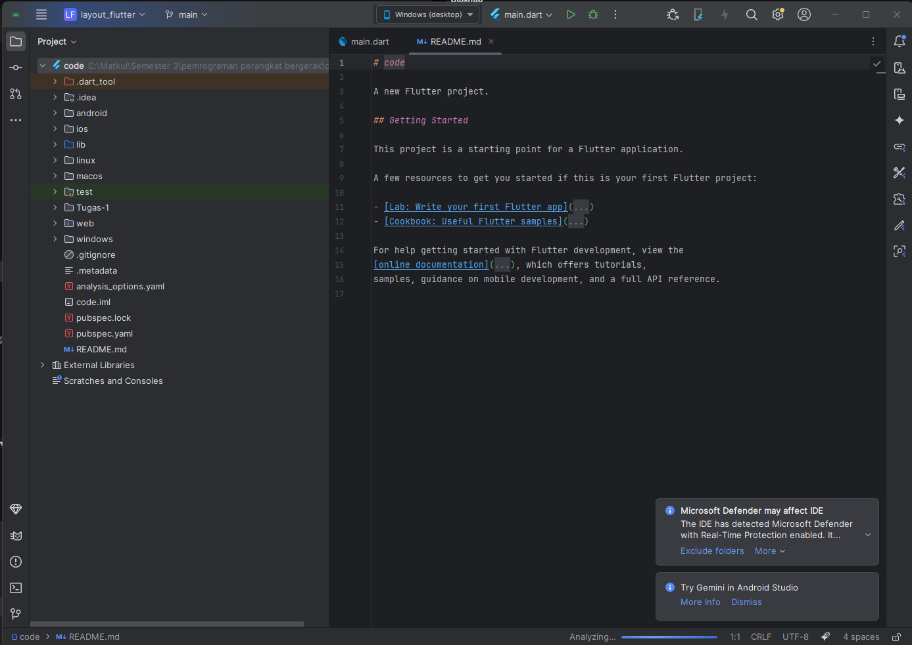
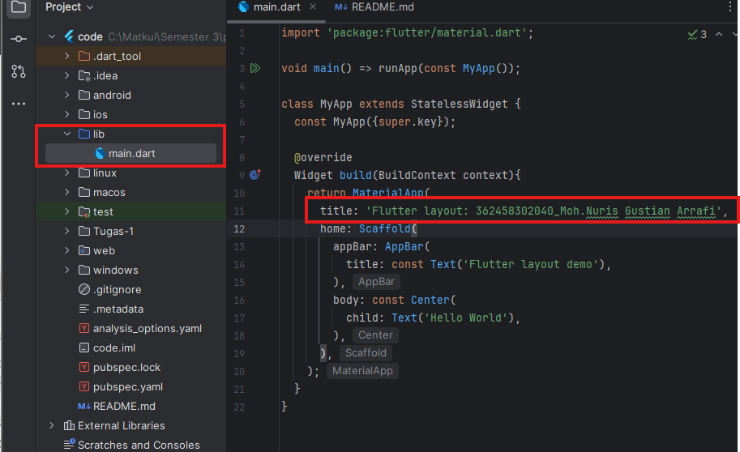
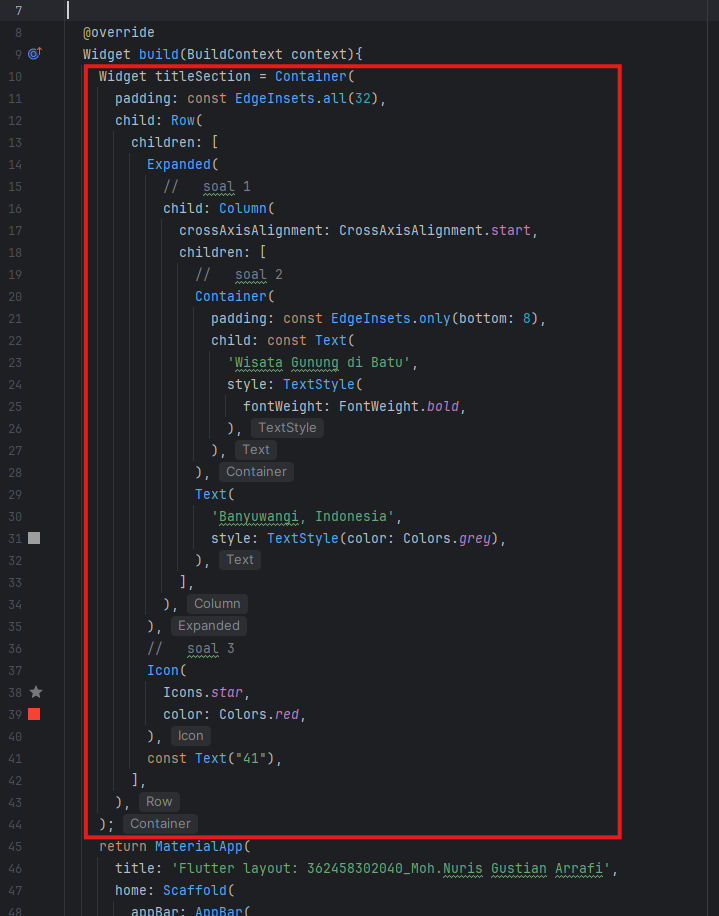
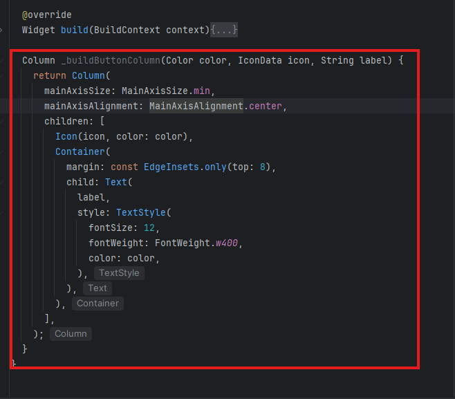
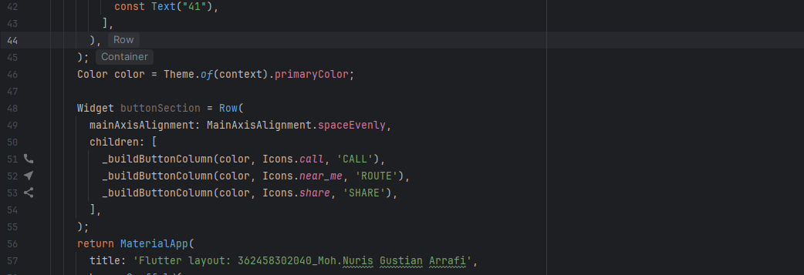

Praktikum 1: Membangun Layout di Flutter

Langkah 1: Membuat Project Baru

Pilih New Flutter Project pada halaman awal android Studio

Pilih Flutter pada bagian kiri

Ganti nama Project dan next

Berikut hasilnya:

Langkah 2: Buka file lib/main.dart
Buka file main.dart lalu ganti dengan kode berikut. Isi nama dan NIM Anda di text title.
Berikut Hasilnya:

Langkah 3: Identifikasi Layout Diagram
Langkah pertama adalah memecah tata letak menjadi elemen dasarnya:

- Identifikasi baris dan kolom.
- Apakah tata letaknya menyertakan kisi-kisi (grid)?
- Apakah ada elemen yang tumpang tindih?
- Apakah UI memerlukan tab?
- Perhatikan area yang memerlukan alignment, padding, atau borders.

Langkah 4: Implementasi Title Row
Pertama, Anda akan membuat kolom bagian kiri pada judul. Tambahkan kode berikut di bagian atas 
metode build() di dalam kelas MyApp:
Berikut Hasilnya:

Praktikum 2: Implementasi Button Row

Langkah 1: Buat Method Column_buildButtonColumn

Langkah 2: Buat Widget Button Selection

Langkah 3: Tambah Button Section Ke Body

Praktikum 3: Implementasi text Section

Langkah 1: Buat widget textSection
tentukan bagian teks sebagai variabel. Masukkan teks ke dalam Container dan tambahkan padding di sepanjang setiap tepinya. Tambahkan kode berikut tepat di bawah deklarasi buttonSection:

Langkah 2: Tambahkan text section ke body
Tambahkan widget variabel textSection ke dalam body seperti berikut:

Praktikum 4: Implementasi image section

Langkah 1: Siapkan aset gambar
Anda dapat mencari gambar di internet yang ingin ditampilkan. Buatlah folder images di root project layout_flutter. Masukkan file gambar tersebut ke folder images, lalu set nama file tersebut ke file pubspec.yaml seperti berikut:

Langkah 2: Tambahkan gambar ke body
Tambahkan aset gambar ke dalam body seperti berikut:

Langkah 3: Terakhir, ubah menjadi ListView
Pada langkah terakhir ini, atur semua elemen dalam ListView, bukan Column, karena ListView mendukung scroll yang dinamis saat aplikasi dijalankan pada perangkat yang resolusinya lebih kecil.

